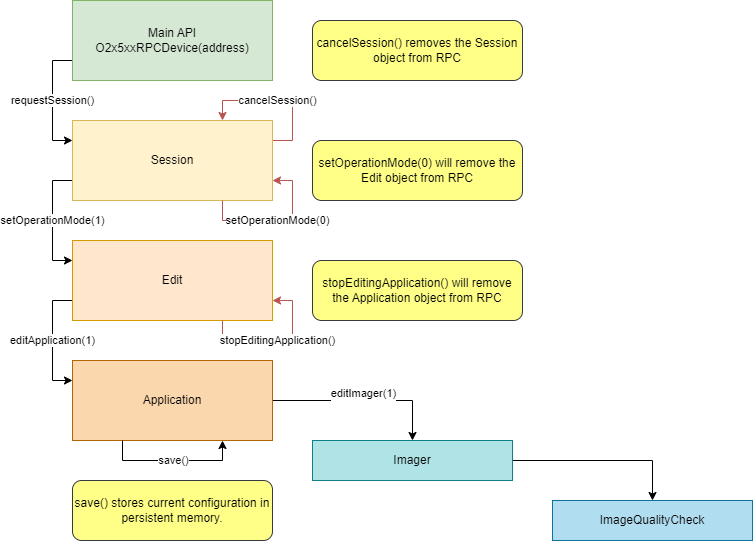

# O2x5xx Sensors Library for Python 3.x

# Table of Contents

* [Description](#Description)
* [Contact](#Contact)
* [Prerequisites](#Prerequisites)
* [Package Installation](#Package-Installation)
* [Quick Start](#Quick-Start)
* [Usage](#Usage)
* [Classes and Methods Description](#Classes-and-Methods-Description)
  * [class Client](#class-Client)
  * [class PCICV3Client](#class-PCICV3Client)
  * [**class O2x5xxPCICDevice**](#class-O2x5xxPCICDevice)
  * [**class O2x5xxRPCDevice**](#class-O2x5xxRPCDevice) *(NEW)*
  * [class ImageClient](#class-ImageClient)
* [Unit Tests](#Unit-Tests)

# Description

A Python 3 library for ifm efector O2x5xx 2D sensors (O2D5xx / O2I5xx).

# Contact

In case of any issues or if you want to report a bug please [contact our](mailto:support.sy@ifm.com) support team
or create an issue in the Github repository.

# Prerequisites

### Dependent Packages (Online)

Usage of examples requires packages listed in the requirements.txt file. Install the packages with

    $ pip install -r requirements.txt

### Dependent Packages (Offline)

In an industrial production it is normally not possible to install packages from an online package manager. 
Therefore you can first download the packages on your personal machine with i-net access with following command

    $ pip wheel -r requirements.txt -w ./packages

and after that you can move that project with downloaded packages and install the package offline 
with following command

    $ pip install --no-index --find-links ./packages -r requirements.txt

# Package Installation

You can install this project/package in your native python or virtualenv with following command:

    $ python setup.py install

After installation, you can import the package and clients from other projects, described in chapter [Usage](#Usage).


# Quick Start

For a quick start, go to the `examples` folder and run the output_recorder.py example with your device's IP address 
to record the asynchronous PCIC output for 3600 seconds and save the output into myFile.txt:

    $ python output_recorder.py 192.168.0.69 myFile.txt 3600

If you want to record the asynchronous PCIC output endless and save the output into myFile.txt, use following example:

    $ python output_recorder.py 192.168.0.69 myFile.txt -1

For vizualizing the image(s) data coming from the camera (requires matplotlib) use following example. 
Each image will be show in an own window:

    $ python image_viewer.py 192.168.0.69

# Usage

The library currently provides clients for the PCIC and RPC interface. You can decide which class with associated 
functionality is best suited for your intended application. The device clients V1 and V2 differ only in the 
architecture and not in the scope of functions. We recommend using the **Device client V2**, which includes the 
full range of functions.

# Classes and Methods Description

### PCIC client

- Create it with following example:

`device_pcic = O2x5xxPCICDevice(address="192.168.0.69", port=50010)`
  providing the device's address and PCIC port.

### RPC client

- Create it with `device_rpc = O2x5xxRPCDevice(address="192.168.0.69")`
  providing the device's address.
 
### Device client V1 (PCIC interface inherited and RPC interface as a composite)

- Create it with `device = o2x5xx.O2x5xxDevice(address="192.168.0.69", port=50010)`
  providing the device's address and PCIC port.
- Send PCIC commands with e.g. 
  `answer = device.occupancy_of_application_list()`. 
- Send RPC commands with e.g. 
  `params = device.rpc.get_all_parameters()`. 

### Device client V2 (both PCIC and RPC interface provided as a composite)

- Create it with `device = o2x5xx.O2x5xxDeviceV2(address="192.168.0.69", port=50010)`
  providing the device's address and PCIC port.
- Send PCIC commands with e.g. 
  `answer = device.pcic.occupancy_of_application_list()`. 
- Send RPC commands with e.g. 
  `params = device.rpc.get_all_parameters()`. 
- 
### An image client for asynchronous image retrieval

- Create it with `image_viewer = o2x5xx.ImageClient(address="192.168.0.69", port=50010)`.
- It configures a PCIC connection to receive all images from the application.
- Read back the next result (a list with header information and dictionary 
  containing all the images) with `result = pcic.readNextFrame()`

# Interface Description

## PCIC

### PCIC objects and methods

```bash
├── O2x5xxPCICDevice (object)
├── activate_application(number)
├── occupancy_of_application_list()
├── upload_process_interface_output_configuration(config)
├── retrieve_current_process_interface_configuration()
├── request_current_error_state()
├── request_current_error_state_decoded()
├── gated_software_trigger_on_or_off()
├── request_device_information()
├── return_a_list_of_available_commands()
├── request_last_image_taken(image_id)
├── request_last_image_taken_deserialized(image_id, datatype)
├── overwrite_data_of_a_string(container_id, data)
├── read_string_from_defined_container()
├── return_the_current_session_id()
├── set_logic_state_of_an_id(io_id, data)
├── request_state_of_an_id(io_id)
├── turn_process_interface_output_on_or_off(state)
├── request_current_decoding_statistics()
├── execute_asynchronous_trigger()
├── execute_synchronous_trigger()
├── set_current_protocol_version(version)
├── request_current_protocol_version()
├── turn_state_of_view_indicator_on_or_off(state, duration)
└── execute_currently_configured_button_functionality()

```

## XML-RPC

To communicate and to configure the device via XML-RPC the XML-RPC commands have to use
different XML-RPC objects. Different commands need different XML-RPC objects (see XML-RPC
command references).

The interface of O3D3xx is structured in an object-oriented way. Some of the objects are available all
the time, others are only available after bringing the device into a special mode by calling a method
on an already available object. This mechanism is used to create system requirements (e.g. password
protection).

It could be necessary to send heartbeats so that there will be no session timeout.
The following diagram should give an overview how objects are related to each other and which methods
must be called to make others available:



### XML-RPC objects and methods

```bash
├── Main API (object) (O2x5xxRPCDevice)
├── getParameter(value)
├── getAllParameters()
├── getSWVersion()
├── getHWInfo()
├── getDmesgData()
├── getClientCompatibilityList()
├── getApplicationList()
├── reboot(mode)
├── switchApplication(applicationIndex)
├── getTraceLogs(nLogs)
├── getApplicationStatisticData(applicationIndex)
├── getReferenceImage()
├── isConfigurationDone()
├── waitForConfigurationDone()
├── measure(measureInput)
├── trigger()
├── doPing()
└── requestSession(password, sessionID)
    └── Session (object)
        ├── @property
        │   ├── OperatingMode
        │   └── edit
        ├── startEdit()  
        ├── stopEdit()  
        ├── heartbeat(heartbeatInterval)  
        ├── doAutoHeartbeat()  
        ├── cancelSession()  
        ├── exportConfig()  
        ├── importConfig(config, global_settings, network_settings, applications)  
        ├── exportApplication(applicationIndex)  
        ├── importApplication(application)  
        ├── getImportProgress()  
        ├── getExportProgress()  
        ├── cleanupExport()  
        ├── getApplicationDetails(applicationIndex)
        ├── resetStatistics()  
        ├── writeApplicationConfigFile(applicationName, data)  
        ├── writeConfigFile(configName, data)  
        ├── readApplicationConfigFile(applicationFile)
        ├── readConfigFile(configFile)
        └── setOperatingMode(mode)  
            └── Edit (object)
                ├── @property
                │   └── application
                ├── stopEditingApplication() 
                ├── createApplication() 
                ├── copyApplication(applicationIndex) 
                ├── deleteApplication(applicationIndex) 
                ├── changeNameAndDescription(applicationIndex, name, description) 
                ├── moveApplications(applicationIndexFrom, applicationIndexTo)
                └── editApplication(applicationIndex) 
                    └── Application (object)
                        ├── @property
                        │   ├── Type
                        │   ├── Name
                        │   ├── Description
                        │   ├── TriggerMode
                        │   ├── FrameRate
                        │   ├── HWROI
                        │   ├── Rotate180Degree
                        │   ├── FocusDistance
                        │   └── ImageEvaluationOrder
                        ├── getAllParameters()
                        ├── getParameter(value)
                        ├── getAllParameterLimits()
                        ├── save()
                        ├── validate()
                        ├── getImagerConfigList()
                        ├── availableImagerConfigTypes()
                        ├── createImagerConfig()
                        ├── copyImagerConfig()
                        ├── deleteImagerConfig()
                        ├── isConfigurationDone()
                        ├── waitForConfigurationDone()
                        └── editImage(imageIndex)
                            └── Imager (object)
                                ├── @property
                                │   ├── ImageQualityCheckConfig (object)
                                │   │   ├── @property
                                │   │   ├── enabled(value)
                                │   │   ├── sharpness_thresholdMinMax(inputDict)
                                │   │   ├── meanBrightness_thresholdMinMax(inputDict)
                                │   │   ├── underexposedArea_thresholdMinMax(inputDict)
                                │   │   └── overexposedArea_thresholdMinMax(inputDict)
                                │   ├── Type
                                │   ├── Name
                                │   ├── Illumination
                                │   ├── IlluInternalSegments
                                │   ├── Color
                                │   ├── ExposureTime 
                                │   ├── AnalogGainFactor
                                │   ├── FilterType
                                │   ├── FilterStrength
                                │   └── FilterInvert
                                ├── getAllParameters()  
                                ├── getParameter(value)  
                                ├── getAllParameterLimits()  
                                ├── startCalculateExposureTime()
                                ├── getProgressCalculateExposureTime()
                                ├── startCalculateAutofocus()
                                ├── stopCalculateAutofocus()
                                ├── getProgressCalculateAutofocus()
                                ├── getAutofocusDistances()
                                └── getAutoExposureResult()

```

# Unit Tests

For testing the source code you have to enter the IP address and TCP/IP port number in the *tests\config.py* file. 
Afterwards you can simply run all tests with following commands:

    $ python .\test_pcic.py

You can run the tests for the PCIC and RPC modules separately with following commands:
    
    $ python .\test_pcic.py
    $ python .\test_rpc.py
    $ python .\test_session.py
    $ python .\test_edit.py
    $ python .\test_application.py
    $ python .\test_imager.py
    $ python .\test_imageQualityCheck.py
